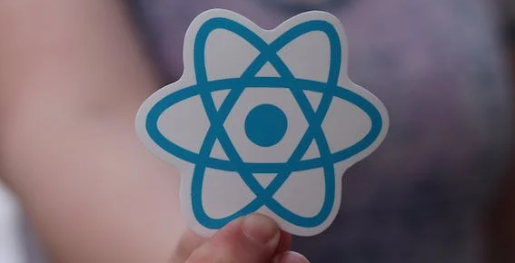
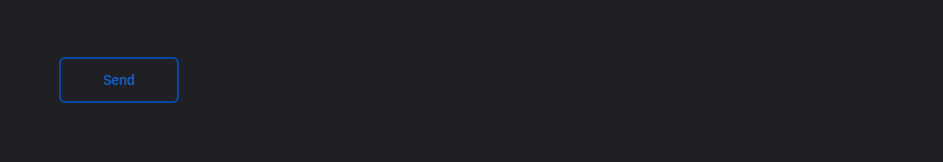

<h1 align="center">Maps Ui - React ⚛️</h1>

<div align="center">
 
</div>

<p align="center">
 <a href="#intro">Introduction</a> •
 <a href="#intro">Documentation</a> •
 <a href="#components">Components</a> •
 <a href="#footer">Footer</a>
</p>

<h3 align="center">Package with  many customizable React components to use in your projects.</h3>

<h4 align="center">
  <a href="">Access Documentation</a> -
  <a href="https://www.npmjs.com/package/@maps-ui/react"> View on NPM</a>
</h4>

---

<h2 id="intro">Introduction</h2>

To install:

```sh
npm install @maps-ui/react
```

To use the components:

```js
import { Button, Box, Tooltip, TooltipProvider } from '@maps-ui/react'

export const MyPage = () => {
  return (
    <TooltipProvider>
      <Box as="section" css={{ padding: '10px' }}>
        <Tooltip content="Send Content">
          <Button variant="secondary">Send</Button>
        </Tooltip>
      </Box>
    </TooltipProvider>
  )
}
```

Result:



<br />

---

<h2 id="docs">Documentation</h2>

To access the complete documentation and see how to use and customize each component, <a href="https://matheusandrade23.github.io/Design-System/?path=/story/home--page">click here.</a>

<br />

---

<h2 id="components">Components</h2>

These are currently the components available for use:

- <a href="">Box</a>

- <a href="">Button</a>
- <a href="">Check box</a>
- <a href="">Multi Step</a>
- <a href="">Text Area</a>
- <a href="">Text Input</a>

- <a href="">Heading</a>
- <a href="">Text</a>

- <a href="">Toast</a>
- <a href="">Tooltip</a>

<br />

---

<p align="center">🌟 If you liked it, consider giving it a star! 🌟</p>
<div id="footer" align="center"><a href="https://www.linkedin.com/in/matheus-andrade23/" target="_blank"></a>
<a href = "mailto:matheusandrade.ma2003@gmail.com"></a></div>
